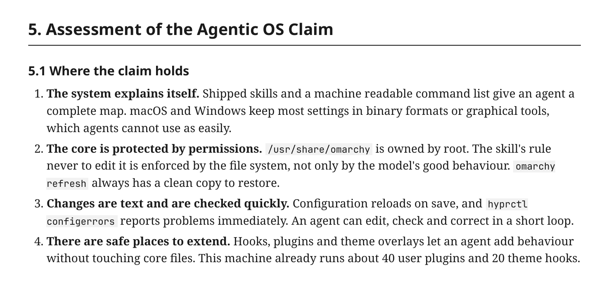
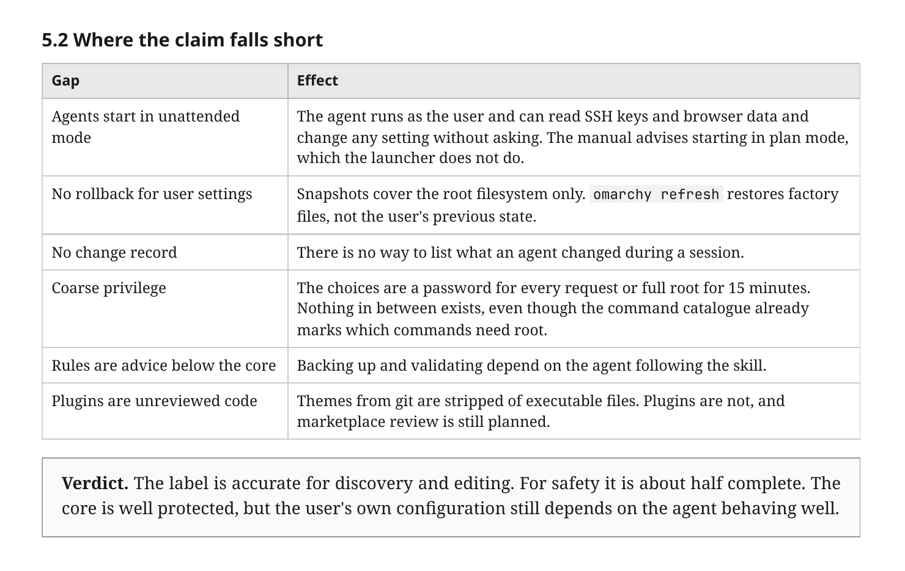
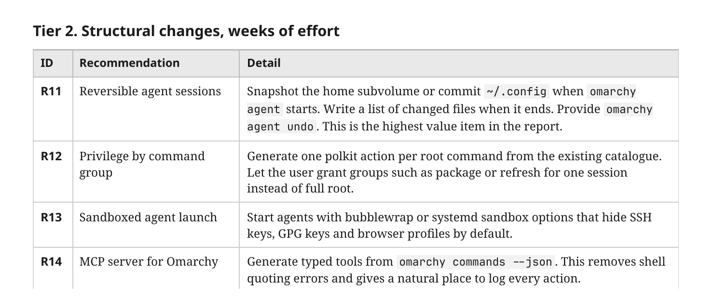

# Omarchy Architecture Review

An 11-page review of Omarchy 4.0: how it is built, why DHH made each choice, and whether the "agentic OS" claim holds up.

📄 **[Read the PDF](Omarchy-Architecture-Review.pdf)** · ⬇️ **[Download](https://raw.githubusercontent.com/sumdahl/omarchy-architecture-review/main/Omarchy-Architecture-Review.pdf)**

**Verdict:** accurate for discovery and editing, about half complete for safety. The highest-value fix is reversible agent sessions (`omarchy agent undo`).

